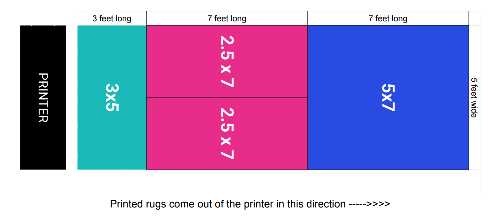

# Ruggable Backend Technical

## Background
Ruggable rugs are made to order. This means that generally speaking we don't stock finished goods and instead we stock raw materials that can be turned into a variety of our products. Our main raw material is a roll of fabric that we print designs on. The length of the roll may vary from roll to roll.

There are 3 different sizes of rugs that need to be printed, 2.5x7's (which are considered runners), 3x5's and 5x7's. Below is an example of the orientation of how the rugs would be laid out when printed.


This table shows how the different size rugs would be printed.
|Rug Size | Length (ft) | Width (ft) | Side by Side Printing |
| --- | --- | --- | --- |
| 2.5' x 7' | 7 | 2.5 | Yes |
| 3' x 5' | 3 | 5 | No |
| 5' x 7' | 7 | 5 | No |
## Problem
 An operator of a printer needs to know what they should be printing next. We try to maintain a first in, first out (FIFO) approach with the exception of items that need to be rushed. They will utilize a web app that calls your endpoint which will tell them the next highest priority items to print.
## Requirements
### Endpoint
- Your endpoint should return a list of the next items that are to be printed.
- These rugs should be in priority order and the position field should reflect this priority.
    - One exception to this is that runners are not always next to each other priority wise. You can pull a runner from later in the queue to fill an empty space
- Only components with a status of `Pending` should be included
- Only orders that have `cancelled` set to false should be included.
- If the request parameter `include_rush` is selected, rush and non-rushed rugs can be returned in the query.
- If the request parameter `include_rush` is set to false, only non-rushed rugs should be returned in the query.
- The sum of the length of the rugs returned should be less than or equal to the length of the roll.
#### Priority
Components are broken into two "buckets." The first bucket is every component that has `rush=true` and the second bucket is all orders where `rush=false`. Within each bucket, the highest priority items are the oldest orders and the rushed orders have priority over non rushed rugs. Below is an example of the priority would work.
 | Component ID | Rush | Order Date |
 | --- | --- | --- |
 | 99 | True | 2020-12-01 |
 | 125 | True | 2020-12-02 |
 | 133 | True | 2020-12-03 |
 | 27 | False | 2020-10-13 |
 | 30 | False | 2020-11-22 |
 | 55 | False | 2020-11-29 |
 | 128 | False | 2020-12-02|

#### Input
Your endpoint should accept the following inputs:
- `roll_length` (decimal) - The length of the roll being planned for in feet.
- `include_rush` (boolean) - if items that are marked as rush should be included in this plan or not

##### Sample Input
```
{
    "roll_length": 25.62,
    "include_rush": true
}
```

#### Output
The data should be returned as JSON.
Your endpoint should return the following:
- `roll_length` (in feet)
- An array of components on a roll titled `plan`. Each entity in the array should contain:
    - `id` (of the component)
    - `component_size`
    - `order_date`
    - `position` - The position should denote where in the plan a rug would be printed. If a runner (a 2.5x7 rug) is printed side by side, both rugs should have the same position. In the example image above, the 5x7 would be in position 1, both 2.5x7's would be in position 2 and the 3x5 would be in position 3.
    - `sku`
    - `rush`
##### Sample Output
```
{
    "roll_id": 2562,
    "length": 14.2
    "plan":[
        {
            "id": 5683,
            "position": 1,
            "size": "2.5x7",
            "order_date": "2020-10-13 04:27:30-07:00",
            "sku": "RS-1234-27",
            "rush": true
        },
        {
            "id": 2562,
            "position": 1,
            "size": "2.5x7",
            "order_date":"2020-09-14 16:24:24-07:00",
            "sku": "RC-1013-27",
            "rush": false
        },
        {
            "id": 9876,
            "position": 2
            "size": "3x5",
            "order_date":"2020-11-22 10:02:06-07:00",
            "sku": "RS-1234-27",
            "rush": true
        },
        {
            "id": 5684,
            "position": 3
            "size": "3x5",
            "order_date":"2020-11-22 10:30:24-07:00",
            "rush": true
        }
    ]
}
```
## Assumptions
- There is only one width of roll, 5 feet wide.
- A line item has a quantity of 1. If more than one of a particular design is ordered, it will appear as a separate line item

## Supplied Tables
- **`component`**: You can think of a component as a synonym for a rug. There will be one component per line item.
- **`line_item`**: A particular item that was ordered. There are potentially n line items for each order
- **`order`**: Contains information about the order.

There is a `db.sql` file included that will set these tables up with some data that you should be able to use.

## Other Considerations
- Feel free to add tables or columns to existing tables.
- Don't remove any of the existing tables, but if you feel there is a better way to handle a situation, make a note of it.
- Feel free using a modern popular language that you are comfortable with. We use Node at Ruggable but we are more interested in how you approach solving the problem over the specific language.
- Don't worry if you aren't able to fully finish everything in time. Focus mainly on the core logic.
- Please upload your code to Github and share the link with us.


# How to run the code
- Since golang is a less common language, and difficult to install 1.14 which includes some nice features including golang modules, a docker setup has been provided to run the code in isolation. This can be run via `make run.docker` which will setup the DB in a docker container, and host the api in `http://localhost:8080/next`.

# Design Decisions
- Since this is a planning operation, it does not need to be extremely quick. However, all efforts were made to make it less DB heavy. To do that, I reduced the DB query complexity as much as possible, and moved as much logic as made sense into the program (which is easier to scale).
- Postgres was used as the database because its what I'm familiar with, is open source and has good options for deploy on AWS/GCP.
- Golang was the language of choice used for the core algorithm. Although I am familiar with node, I prefer golang for web API operations because of performance, explicit declarations of features and operation, types, web tools and familiarity. This could just have easily been done with Node, but I have less experience with the packages used in Node.


# Missing features from the Algorithm
- Priority Lock
  - If priority rugs are always being submitted, and there isn't enough printers to fullfil the load, non-high priority rugs should "convert" into
    priority rugs if in the queue for over a set period of time (1-2 days). This can be done by adding the comparison in `HighestPriority` function.
    ```golang
    if time.Now().Add(-time.Hour*24).After(r.OrderDate) || time.Now().Add(-time.Hour*24).After(l.OrderDate) {
	 	return r.OrderDate.After(l.OrderDate)
    }
    ```
- Optimal Fabric Usage
  - Waste is an important metric when calculating cost, right now the rug planning uses a priority based approach based on order, it should also take into consideration how much material is wasted on a non-planned print. I wrote a simple planner (`UseRugBlocks`) which will optimally determine how many blocks can be printed to best accommodate the space of the rug. For example, if a rug of size 9 is submitted to the `/next` endpoint, it could be fullfiled by 3*3x5 rugs (with zero wasted material) or 1*5x7 (with 2ft of wasted material). Optimal planning can reduce labor and material costs.
- Unfulfilled order timeout
  - As listed below, printer failure is a hard edgecase, there should be an unfulfilled order timeout, where if an order has been scheduled to a roll, but not been confirmed printed or fullfilled, it should be rescheduled within a certain amount of time.
- Order Neighboring
  - To save on packaging and transportation costs, orders with the same destination address should all be printed around the same time in the same factory.

# Edge Cases
- Printer Failure
  - If the printer is assigned a roll, and fails to print it, then the roll assigned to that printer needs to be requeued or reprinted.
  - If the printer fails halfway, or some rugs were printed incorrectly, they will need to be requeued or reprinted.
- Order Cancellation
  - What happens if an order has been canceled but product has already been printed, how do we organize that in the database?
- Rug size is wrong
  - A fragment is two small to be printed on, or no product is available to fill the rug portions.
- As mentioned above, Priority Lock is a problem. If priority is overused, some rugs may never be printed.


# Data Considerations About Schema
- No Traceability of datetime makes it hard to make assumptions about how rug production works. When the `component.status` is updated, there is no record of when/why that was updated, this makes it hard to answer questions about our data:
  - What is the average time until an order is cancelled?
  - How long does it take for a rug to be printed after an order is received?
- No Information about users/accounts/permissions, who authorized the request, who has permission to cancel said job and why.

# Observability and Stability
- This application has limited observability into what it's doing, and it's status. Simple logging was added.
- For a production ready applicaiton, some better observability into what the API is doing would be needed such as prometheus.
- Deploy was not created for this app, but a health endpoint, and some other management tools should be added to make changes while the service is running.
- Logs should be shipped to a log aggregator and alerts can be setup to provide stability.

# Testing and Simulation

Testing is very important to understanding how an API would function, and make sure that it functions correctly in the real world. Unit tests can be a great way to test if individual functions and programs work, but they do not cover the operation of the API "in the wild". Simulation bridges this gap, by simulating how resources interact with eachother, and identify use-cases and edge cases based on "real" data. Simulation software is primarily limited to python for scientific use. SimPy is a process-based discrete-event simulation framework which can model which uses python generation to do a time-idependent simulation. We can use simpy to generate data, impersonate a user, manage resources, and gauge performance and accuracy. For this Project, I created a simple simulation which does not generate data, but impersonates a printer asking for print jobs.

### Benifits of Simulation

Simulation offers huge benifits, there are a few buisness based operations where we can use simulation to make buisness decisions:
- How many printers do I need?
  - Using simulation, we can simulate order frequency, and growth, and model out how many printers we need to satisfy load. This can give us a good estimate the optimal number of printers we need. This can save money as printers are not over-purchased.
- What kind of load clogs up my system?
  - Using simulation, you can generate uncharacteristic load and see how the system responds. What if a runner rug drops and sales of runner's doubles. We can use simulation to model the characteristics of this load, and see if we can handle and optomise it.
- Does a new algorithm perform better or worse?
  - Simulation can also be used within the development pipeline to determine the cost/benifits tradeoff of a new planning algorithm. A well defined simulation can produce quantifyable results about how the algorithm effects lead times.
- Seasonal load
  - Simulation can also use historical data, and simulate potential problems and offer solutions.

Example Run:
```bash
$ make sim.docker
[....docker setup.....]
python3 sim/sim.py
Printer 0 starts up
Printer 0 starts printing job of length 13 on 17
|---| 2.5x7 |---|
|3x5|-------|3x5|
|---| 2.5x7 |---|
Printer 0 completed printing job of length 13
Printer 0 created a rug segment of size 2
Printer 0 starts printing job of length 7 on 15
| 2.5x7 |
|-------|
|       |
Printer 0 completed printing job of length 7
Printer 0 created a rug segment of size 8
wasted material (ft): 5.5
```

The example above shows a basic run of the simulation, and you can already see from this simple example how there are potential optimizations. Since we're using a greedy time based algorithm, orders are processed in the order they are received, not making an effort to reduce waste. As we can see, we might use a 3x5 rug, when a 5x7 or 2*2.5x7 could be used in it's place. Also, printing runners without a partner is a 3.5 ft waste, if we understand how runners are ordered, we can potentially wait a set period of time for another runner to be ordered. We could also change targeted advertizing to get people to order a runner (or pre-print one).

### Limitations of the Simulation

This simulation is limited and does not include key features which would exist if I had more time:
- No way to generate orders.
- No way to generate orders from historical data.
- No way to simulate breaks/unforeseen consequences.
- No way to calcualte how long it takes rugs to be delivered since order time.
- No way to simulate restocking and inventory.
- No way to simulate workers.

### Next Steps

There are lots of configurable options for the API that will affect how the planning is completed. Each configurable option can greatly change the output of the planner, both in time and waste and resources as a tradeoff. This is where AI algorithms such as linear regression (choosing the most optimal variables in a mx+b format to get the best results) can be used with the simulation to optimize on these parameters.

